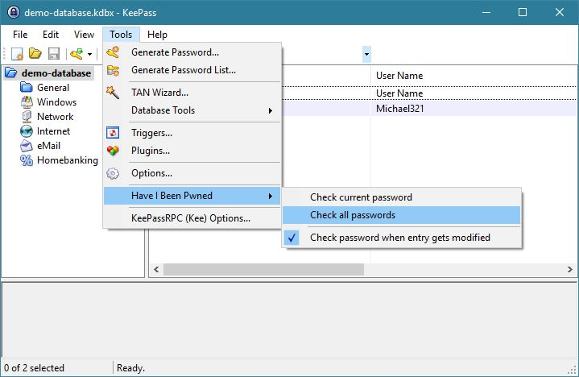
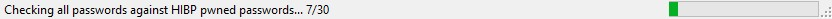
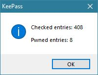
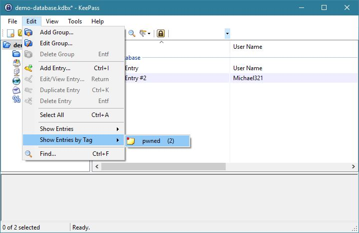
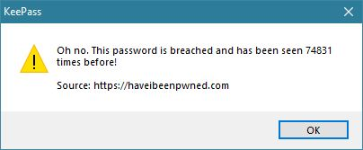
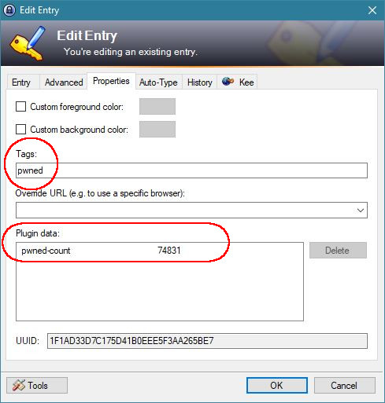
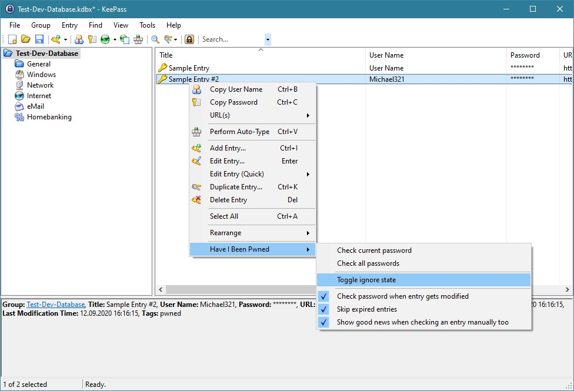

# Have I Been Pwned KeePass Plugin

Simple [KeePass plugin] which uses the service [Have I Been Pwned](https://haveibeenpwned.com/) from [Troy Hunt](https://www.troyhunt.com)

## [Changelog](./CHANGELOG.md)

## Installation and Updates
### Requirements
#### Windows
 - [.NET Framework 4.7.2](https://dotnet.microsoft.com/download/thank-you/net472) or higher

#### Linux
 - [Mono 5.18](https://www.mono-project.com/docs/about-mono/releases/5.18.0/) or higher
 - On some Linux systems, the `mono-complete` package may be required for plugins to work properly ([Details on keepass.info](https://keepass.info/help/v2/setup.html#mono))

### How to install/update
 1. Download the [latest release (.dll file) from GitHub](https://github.com/kapsiR/HaveIBeenPwnedKeePassPlugin/releases)
 2. In KeePass, click 'Tools' → 'Plugins' → button 'Open Folder'  
    *KeePass now opens a folder called 'Plugins'*
 3. Exit KeePass to free up the lock on the plugin
 4. Move the plugin file into the 'Plugins' folder (replace if exists already)  
 5. Start KeePass again

### Uninstall 
 1. In KeePass, click 'Tools' → 'Plugins' → button 'Open Folder'  
    *KeePass now opens a folder called 'Plugins'*  
 2. Exit KeePass to free up the lock on the plugin
 3. Delete the plugin file

## Some impressions:
- Check all passwords in the opened database  

- Check all passwords status indicators  

- Check all passwords result  

- Show all entries which are pwned  

- Check the current selected entry  

- Check the current selected entry result  

- Toggle the ignore-state of a single entry  

[KeePass plugin]: https://keepass.info/help/v2/plugins.html
