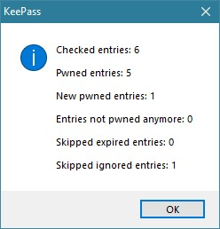

# Have I Been Pwned KeePass Plugin

Simple [KeePass plugin] which uses the service [Have I Been Pwned](https://haveibeenpwned.com/) from [Troy Hunt](https://www.troyhunt.com)

## [Changelog](./CHANGELOG.md)

## Installation and Updates
### Requirements
 - [.NET Framework 4.7.2](https://dotnet.microsoft.com/download/thank-you/net472)

### How to install/update
 1. Download the [latest release (.dll file) from GitHub](https://github.com/kapsiR/HaveIBeenPwnedKeePassPlugin/releases)
 2. In KeePass, click 'Tools' → 'Plugins' → button 'Open Folder'  
    KeePass now opens a folder called 'Plugins'
 3. Move the plugin file into the 'Plugins' folder

### Uninstall 
 1. In KeePass, click 'Tools' → 'Plugins' → button 'Open Folder'  
    KeePass now opens a folder called 'Plugins'
 2. Delete the plugin file

## Some impressions:
- Check all passwords in the opened database  

- Check all passwords result  

- Show all entries which are pwned  

- Check the current selected entry  

- Check the current selected entry result  

[KeePass plugin]: https://keepass.info/help/v2/plugins.html