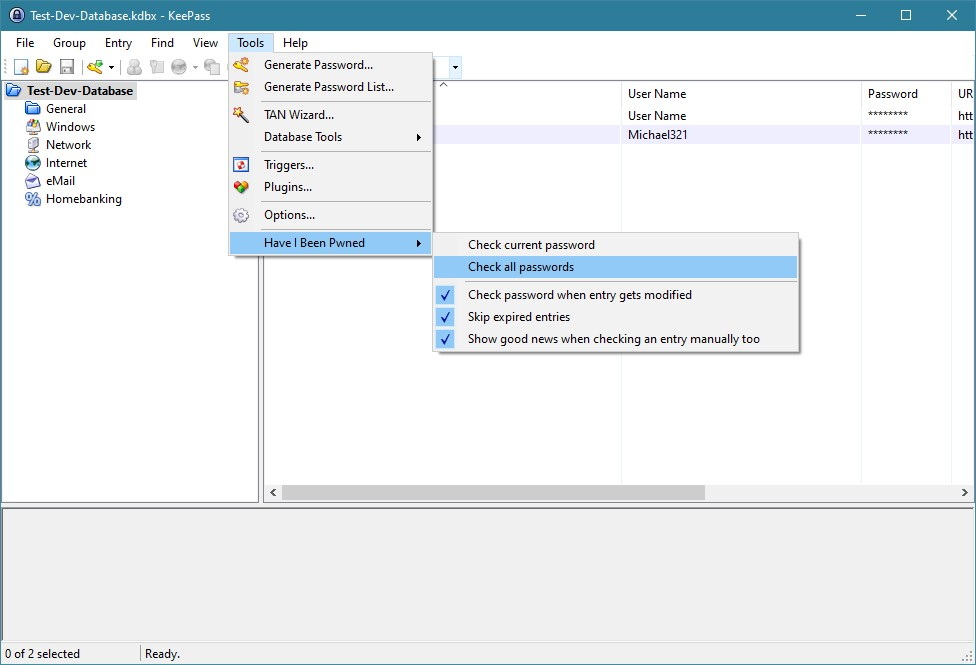
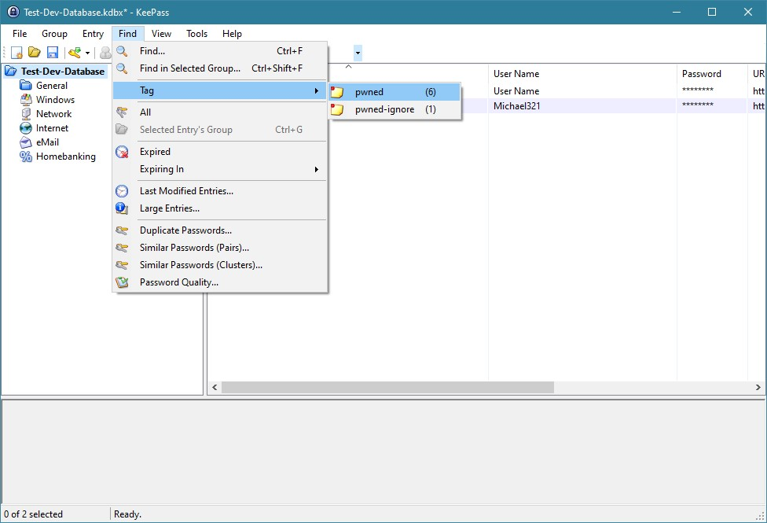

# Have I Been Pwned KeePass Plugin

Simple KeePass plugin which uses the service [Have I Been Pwned](https://haveibeenpwned.com/) from [Troy Hunt](https://www.troyhunt.com)

##### Some impressions:
- Check all passwords in the opened database  

- Check all passwords result  

- Show all entries which are pwned  

- Check the current selected entry  

- Check the current selected entry result  

##### Roadmap:
 - [ ] Improve handling of "has database been modified" (only indicate it if there is really any change)
 - [ ] When checking all passwords, add any status indicator
 - [ ] Publish a release on GitHub (including a .plgx file)
 - [ ] Add requirements to Readme (e.g. .NET Framework version)
 - [ ] Should I remove dependency on System.ValueTuple? (target .NET 4.7.2 or remove it?)
